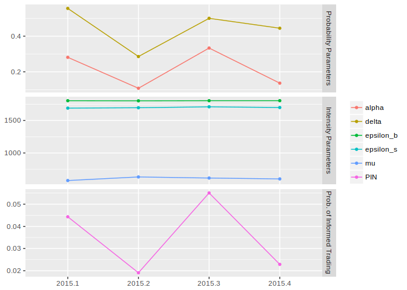
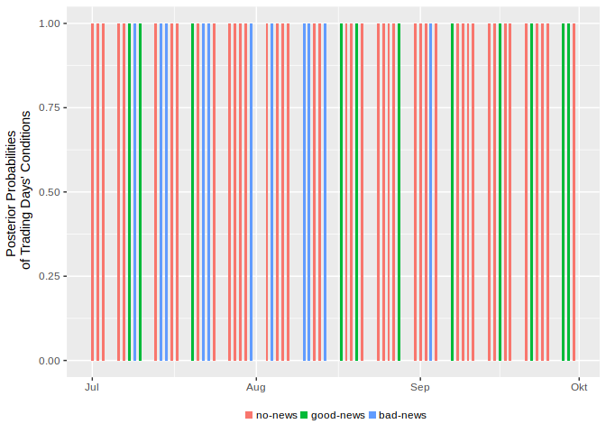

<!-- README.md is generated from README.Rmd. Please edit that file -->

[](https://travis-ci.org/anre005/pinbasic)
[](https://cran.r-project.org/package=pinbasic)
[](http://depsy.org/package/r/pinbasic)

# pinbasic: Fast and Stable Estimation of the Probability of Informed Trading (PIN)

The `pinbasic` package ships utilities for fast and stable estimation of
the probability of informed trading in the static PIN framework. The
function design is chosen to fit the extended EHO model setup but can
also be applied to the simpler EKOP model by equating the intensities of
uninformed buys and sells. State-of-the-art factorization of the model
likelihood function as well as most recent algorithms for generating
initial values for optimization routines are implemented. In total, two
likelihood factorizations and three methodologies for starting values
are included. Likelihood functions are evaluated with `pin_ll` and sets
of starting values are returned by `initial_vals`. The probability of
informed trading can be estimated for arbitrary length of daily buys and
sells data with `pin_est` which is a wrapper around the workhorse
function `pin_est_core`. No information about the time span of the
underlying data is required to perform optimizations with `pin_est`.
However, the recommendation given in the literature is using at least
data for 60 trading days to ensure convergence of the likelihood
maximization. Quarterly estimates are returned by `qpin` which can be
visualized with `ggplot`. Datasets of daily aggregated numbers of buys
and sells can be simulated with `simulateBS`. Calculation of confidence
intervals for the probability of informed trading can be enabled by
`confint` argument in optimization routines (`pin_est_core`, `pin_est`
and `qpin`) or by calling `pin_confint` directly. Additionally,
posterior probabilities for conditions of trading days can be computed
with `posterior` and plotted with `ggplot`.

## Examples

The dataset `BSfrequent` cover 60 trading days and represent a
frequently traded equity. Model parameters and the probability of
informed trading can be estimated with `pin_est`.

``` r
library(pinbasic)

# Loading data
data("BSfrequent")

# Estimation
pin_freq <- pin_est(numbuys = BSfrequent[,"Buys"], numsells = BSfrequent[,"Sells"])
pin_freq
#> $Results
#>            Estimate  Std. error    t value      Pr(> t)
#> alpha        0.2000  0.05163873   3.873062 0.0001074766
#> delta        0.5000  0.14433702   3.464115 0.0005319794
#> epsilon_b 1805.4354  5.67230494 318.289553 0.0000000000
#> epsilon_s 1700.6753  5.50984189 308.661358 0.0000000000
#> mu         597.6107 14.60600145  40.915421 0.0000000000
#> 
#> $ll
#> loglike 
#> 1415607 
#> 
#> $pin
#>        PIN 
#> 0.03296587 
#> 
#> $conv
#> Convergence 
#>           0 
#> 
#> $message
#> [1] "relative convergence (4)"
#> 
#> $iterations
#> Iterations 
#>          1 
#> 
#> $init_vals
#>     alpha     delta epsilon_b epsilon_s        mu 
#>    0.2000    0.5000 1805.4259 1700.6852  597.6111 
#> 
#> $posterior
#>                 no         good          bad
#>  [1,] 1.000000e+00 1.054677e-28 8.603585e-38
#>  [2,] 1.000000e+00 1.708301e-41 5.437236e-31
#>  [3,] 1.000000e+00 7.029207e-40 1.412484e-38
#>  [4,] 2.119110e-45 2.484190e-80 1.000000e+00
#>  [5,] 4.284377e-34 1.000000e+00 8.485090e-66
#>  [6,] 1.000000e+00 2.173042e-38 3.616880e-32
#>  [7,] 1.000000e+00 1.657474e-39 2.486257e-44
#>  [8,] 6.148468e-35 8.501740e-62 1.000000e+00
#>  [9,] 1.000000e+00 1.584055e-36 7.734248e-39
#> [10,] 1.000000e+00 6.617151e-36 9.224399e-43
#> [11,] 3.419344e-38 1.000000e+00 2.743870e-70
#> [12,] 1.000000e+00 1.264228e-40 9.395923e-40
#> [13,] 1.000000e+00 1.785679e-25 3.020421e-45
#> [14,] 1.000000e+00 6.820067e-38 3.359919e-44
#> [15,] 1.000000e+00 3.624041e-34 7.734248e-39
#> [16,] 6.036227e-38 1.015713e-77 1.000000e+00
#> [17,] 1.000000e+00 1.226614e-38 2.922883e-34
#> [18,] 1.000000e+00 5.443069e-42 2.276597e-42
#> [19,] 1.000000e+00 9.928515e-25 6.952753e-40
#> [20,] 3.917168e-47 1.000000e+00 1.103522e-86
#> [21,] 1.435856e-43 1.121835e-89 1.000000e+00
#> [22,] 1.000000e+00 1.632631e-38 1.908825e-38
#> [23,] 1.000000e+00 2.076785e-35 2.486257e-44
#> [24,] 1.540415e-42 1.000000e+00 1.148294e-86
#> [25,] 1.000000e+00 6.324039e-33 1.908825e-38
#> [26,] 1.000000e+00 2.892333e-38 3.737577e-43
#> [27,] 1.000000e+00 7.029207e-40 4.023421e-31
#> [28,] 1.000000e+00 9.642821e-42 2.627545e-35
#> [29,] 1.000000e+00 9.498287e-41 4.540581e-44
#> [30,] 1.000000e+00 1.560312e-35 2.235037e-45
#> [31,] 1.789734e-33 1.000000e+00 5.903585e-80
#> [32,] 1.472181e-39 1.000000e+00 7.064422e-74
#> [33,] 1.000000e+00 1.322823e-43 2.405970e-33
#> [34,] 1.000000e+00 2.764215e-35 3.192063e-36
#> [35,] 1.000000e+00 1.024329e-45 4.313742e-36
#> [36,] 1.000000e+00 2.045657e-34 9.395923e-40
#> [37,] 1.000000e+00 3.463511e-31 5.144867e-40
#> [38,] 1.000000e+00 1.632631e-38 1.412484e-38
#> [39,] 1.000000e+00 5.201964e-39 8.446526e-41
#> [40,] 1.000000e+00 4.472796e-29 1.520508e-26
#> [41,] 1.000000e+00 1.632631e-38 1.944319e-35
#> [42,] 1.000000e+00 3.072441e-42 3.550854e-35
#> [43,] 1.000000e+00 2.848980e-37 7.734248e-39
#> [44,] 1.000000e+00 2.108388e-36 6.825829e-43
#> [45,] 1.000000e+00 2.108388e-36 2.154180e-51
#> [46,] 1.000000e+00 1.513888e-33 8.024552e-33
#> [47,] 1.000000e+00 6.617151e-36 1.600465e-34
#> [48,] 1.000000e+00 2.108388e-36 3.020421e-45
#> [49,] 1.000000e+00 1.120353e-32 7.213723e-34
#> [50,] 2.401133e-41 4.101858e-82 1.000000e+00
#> [51,] 1.000000e+00 1.103560e-31 7.734248e-39
#> [52,] 1.000000e+00 7.355002e-43 1.684626e-42
#> [53,] 1.000000e+00 5.695348e-45 8.446526e-41
#> [54,] 1.000000e+00 5.201964e-39 1.514405e-43
#> [55,] 1.000000e+00 4.897022e-35 1.571248e-37
#> [56,] 1.000000e+00 6.923847e-39 1.293372e-36
#> [57,] 1.000000e+00 6.617151e-36 1.341919e-30
#> [58,] 1.000000e+00 1.172280e-35 3.877866e-37
#> [59,] 5.426305e-39 3.757091e-77 1.000000e+00
#> [60,] 1.000000e+00 2.486910e-28 2.084616e-40
#> attr(,"class")
#> [1] "matrix"    "posterior"
```

`BSfrequent2015` contains simulated daily buys and sells for a
frequently traded equity for business days in 2015. `qpin` returns
quarterly estimates which can be visualized with `ggplot`.

``` r
# Quarterly PIN estimates
# Confidence interval computation enabled:
#   * using only 1000 simulated datasets
#   * confidence level set to 0.95
#   * seed set to 123

data('BSfrequent2015')
qpin2015 <- qpin(numbuys = BSfrequent2015[,"Buys"], numsells = BSfrequent2015[,"Sells"],
                 dates = as.Date(rownames(BSfrequent2015), format = "%Y-%m-%d"),
                 confint = TRUE, ci_control = list(n = 1000, seed = 123))

# Print confidence intervals for all four quarters
ci_quarters <- lapply(qpin2015[["res"]], function(x) x$confint)
ci_quarters
#> $`2015.1`
#>       2.5%      97.5% 
#> 0.02752256 0.05943952 
#> 
#> $`2015.2`
#>        2.5%       97.5% 
#> 0.006405346 0.033145972 
#> 
#> $`2015.3`
#>       2.5%      97.5% 
#> 0.03658681 0.07322781 
#> 
#> $`2015.4`
#>       2.5%      97.5% 
#> 0.01014942 0.03794254

# Visualization of estimated parameters
library(ggplot2)
ggplot(qpin2015[["res"]])
```

<!-- -->

Posterior probabilities of trading days’ condition are returned by
`posterior` and can be displayed with `ggplot`. The following code chunk
shows how posterior probabilities for `BSfrequent2015` in the third
quarter can be calculated and visualized.

``` r
# Corresponding parameter estimates
freq_2015.3 <- qpin2015[["res"]]$'2015.3'$Results[,"Estimate"]

# Subsetting data
third_quarter <- subset(BSfrequent2015, subset = lubridate::quarter(rownames(BSfrequent2015)) == 3)

# Calculating posterior probabilities
post_third <- posterior(param = freq_2015.3, 
                        numbuys = third_quarter[,"Buys"], numsells = third_quarter[,"Sells"])

# Plotting
ggplot(post_third)
```

<!-- -->

## Installation

You may install the stable version from **CRAN**, or the development
version from GitHub using **devtools**:

``` r
# install from CRAN
install.packages("pinbasic")

# install from github using devtools
devtools::install_github("anre005/pinbasic")
```
