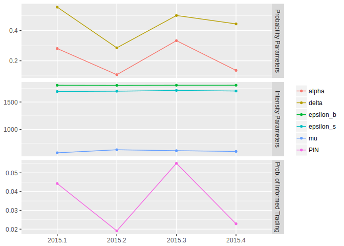

<!-- README.md is generated from README.Rmd. Please edit that file -->
[](https://travis-ci.org/anre005/pinbasic)

pinbasic: Fast and Stable Estimation of the Probability of Informed Trading (PIN)
=================================================================================

Utilities for fast and stable estimation of the probability of informed trading (PIN) in the model introduced by Easley, Hvidkjaer and O'Hara (EHO, 2002) are implemented. Since the model developed by Easley, Kiefer, O'Hara and Paperman (EKOP, 1996) is nested in the EHO model due to equating the intensity of uninformed buys and sells, functionalities can also be be applied to this simpler model structure, if needed. State-of-the-art factorization of the model likelihood function as well as hierarchical agglomerative clustering algorithm for generating initial values for optimizations are provided. In total, two different likelihood factorizations and three methodologies generating starting values are implemented. The probability of informed trading can be estimated for arbitrary length of daily buys and sells data with `pin_est` function which is a wrapper around the workhorse function `pin_est_core`. No information about the time span of the underlying data is needed to perform optimizations. However, recommendation given in the literature is using at least data for 60 trading days to ensure convergence of the likelihood maximization. The `qpin` function delivers quarterly estimates. The number of available quarters in the data are detected utilizing functions from the **lubridate** package. Quarterly estimates can be visualized with the `qpin_plot` function.

Examples
--------

``` r
library(pinbasic)

data("BSfrequent")
pin_est(numbuys = BSfrequent[,"Buys"], numsells = BSfrequent[,"Sells"])
#> $Results
#>            Estimate  Std. error    t value      Pr(> t)
#> alpha        0.2000  0.05163873   3.873062 0.0001074766
#> delta        0.5000  0.14433702   3.464115 0.0005319794
#> epsilon_b 1805.4354  5.66700075 318.587465 0.0000000000
#> epsilon_s 1700.6753  5.50983422 308.661788 0.0000000000
#> mu         597.6107 14.60546004  40.916937 0.0000000000
#> 
#> $ll
#> loglike 
#> 1415607 
#> 
#> $pin
#>        PIN 
#> 0.03296587 
#> 
#> $conv
#> Convergence 
#>           0 
#> 
#> $message
#> [1] "relative convergence (4)"
#> 
#> $iterations
#> Iterations 
#>          1 
#> 
#> $init_vals
#>     alpha     delta epsilon_b epsilon_s        mu 
#>    0.2000    0.5000 1805.4259 1700.6852  597.6111
```

``` r
# Quarterly Estimates and Visualization for one year of synthetic data
data('BSfrequent2015')
qpin2015 <- qpin(numbuys = BSfrequent2015[,"Buys"], numsells = BSfrequent2015[,"Sells"],
                 dates = as.Date(rownames(BSfrequent2015), format = "%Y-%m-%d"))

qpin_plot(qpin2015)
```



Installation
------------

You may install the stable version from **CRAN**, or the development version using **devtools**:

``` r
# install from CRAN
install.packages("pinbasic")

# install from github using devtools
devtools::install_github("anre005/pinbasic")
```

Github
------

[Github Repo:anre005/pinbasic](https://github.com/anre005/pinbasic)
